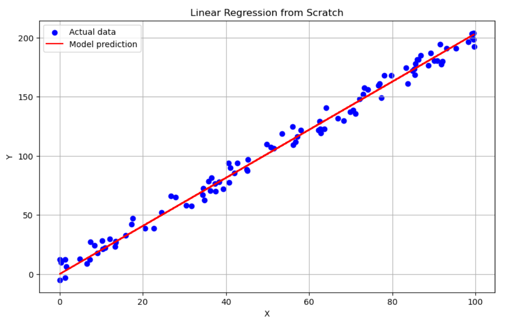

# 📈 Linear Regression from Scratch

👋 A small project where I built a linear regression algorithm—no numpy, no sklearn, just pure Python—to explore gradient descent and cost minimize tech from ground zero.


---

## 🚀 How to Run

Clone the repo and run the scripts directly from your terminal:

```bash
# Clone the repo
git clone https://github.com/zarqash02/Linear_Regression_From_Scratch.git
cd Linear_Regression_From_Scratch

# Generate the dataset
python src/generate_dataset.py

# Train the model
python src/linear_regression.py
```
## 📁 Project Structure

├── data/ # Generated dataset CSV
├── notebooks/ # Jupyter notebooks for visualization/testing
├── src/ # Core logic for data gen and model training
│ ├── generate_dataset.py
│ └── linear_regression.py
├── .gitignore
├── README.md
└── .gitattributes

---

### ✅ What To Do:
- Add this block under the existing part of your `README.md`
- Save it
- In GitHub Desktop: **Commit** → `Add project structure + run instructions` → **Push**


## 🚀 Features

- Generates a toy dataset using a simple linear formula `y = 2x + 3 + noise`
- Implements gradient descent for linear regression
- Calculates cost (MSE)
- Plots actual data vs predicted line using matplotlib
- All logic written without any ML/DL libraries

---

## 🧠 What I Learned

- How gradient descent updates weights
- How to implement machine learning logic from scratch
- Why loss functions matter
- Basics of linear regression in depth

1. Clone the repo
2. Run `notebooks/demo.ipynb` for the full walkthrough
3. Dataset is generated using `src/generate_dataset.py`


## 📸 Sample Output

Here’s a quick look at the model’s predictions vs actual data:




> Made with ❤️ by Zarqash
